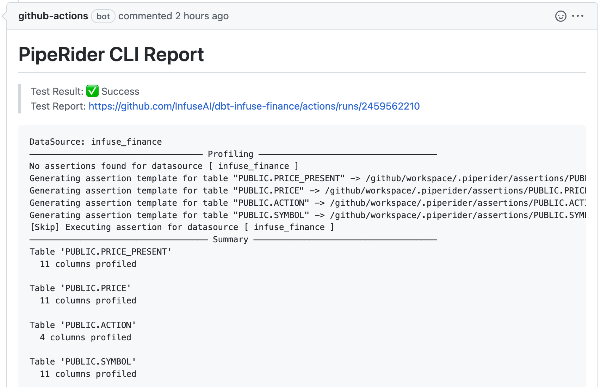
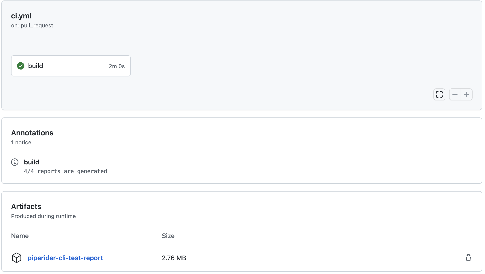

# dbt-infuse-finance

This existed dbt demo project will help you explore
[piperider-action](https://github.com/marketplace/actions/piperider-cli-action),
which is our CI tool based on github actions.

1. clone our dbt demo project
    
2. adjust dbt modeling `models/PRICE_PRESENT.sql`
    
    original version
    ```sql
    {{ config(materialized='table') }}
    
    select * from {{ source('PUBLIC', 'PRICE') }} where PRICE.DATE >= '2021-01-01' and PRICE.DATE < '2022-04-01'
    ```
    
    new version
    ```sql
    {{ config(materialized='table') }}
    
    select * from {{ source('PUBLIC', 'PRICE') }} where PRICE.DATE >= '2021-01-01'
    ```
    
3. create a PR to this repo and the CI workflow, `piperider-action`, will be triggered:
    - the profiling result will be attached to PR comment.
   
    - reports will be uploaded as CI's artifacts.
   

To explore more detail of dbt integration, please check our [developer document](./docs/Developer.md).
