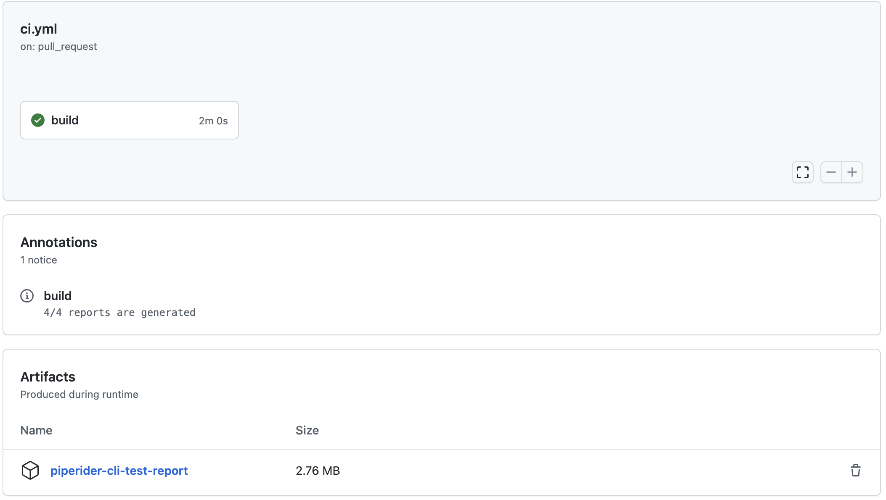

# dbt-infuse-finance 

## III. Continuous Integration

This section is going to share how we integrate PipeRider action into a dbt project.
[PipeRider-Action](https://github.com/marketplace/actions/piperider-cli-action) is our 
CI tool based on GitHub actions.

Here is our CI workflow arrangement in this example:
https://github.com/InfuseAI/dbt-infuse-finance/blob/main/.github/workflows/ci.yml

Because we would like to integrate with a dbt project, we need to state some steps before we run PiperRider Action.

1. We need to provide a dbt 
[profiles.yml](https://github.com/InfuseAI/dbt-infuse-finance/blob/main/profiles.yml), which lists the credential we need.
**Be cautious, please don't put your real credential into source control.** We can just leverage GitHub 
(encrypted secrets)[https://docs.github.com/en/actions/security-guides/encrypted-secrets].
Also, it's required to provide customized path of profile. 

2. Running `dbt docs generate` is essential for PipeRider to know the target.

Here you're all set now!

1. clone our dbt demo project

2. adjust dbt modeling `models/PRICE_PRESENT.sql`

    original version
    ```sql
    {{ config(materialized='table') }}
    
    select * from {{ source('PUBLIC', 'PRICE') }} where PRICE.DATE >= '2021-01-01' and PRICE.DATE < '2022-04-01'
    ```

    new version
    ```sql
    {{ config(materialized='table') }}

    select * from {{ source('PUBLIC', 'PRICE') }} where PRICE.DATE >= '2021-01-01'
    ```

3. create a PR to this repo and the CI workflow, `piperider-action`, will be triggered:
    - the profiling result will be attached to PR comment.
   
    - reports will be uploaded as CI's artifacts.
   

Here is a demo example [PR](https://github.com/InfuseAI/dbt-infuse-finance/pull/10) showing what it could look like.
